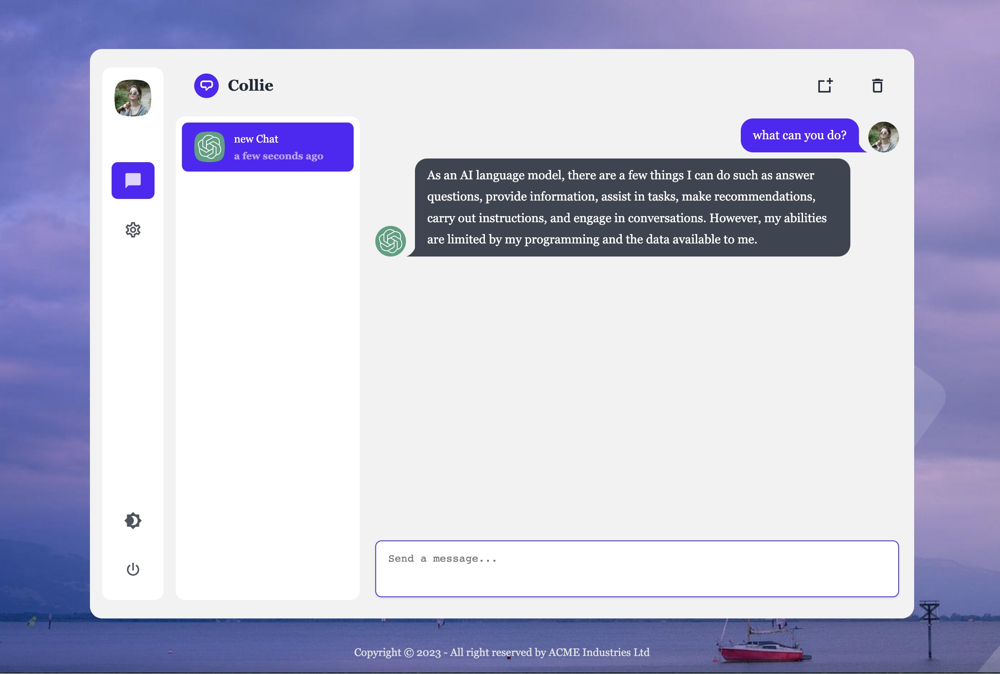
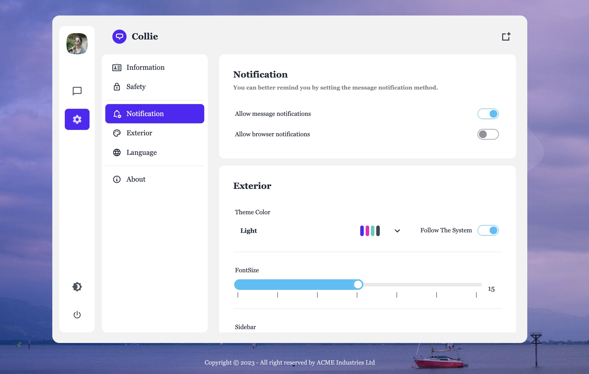
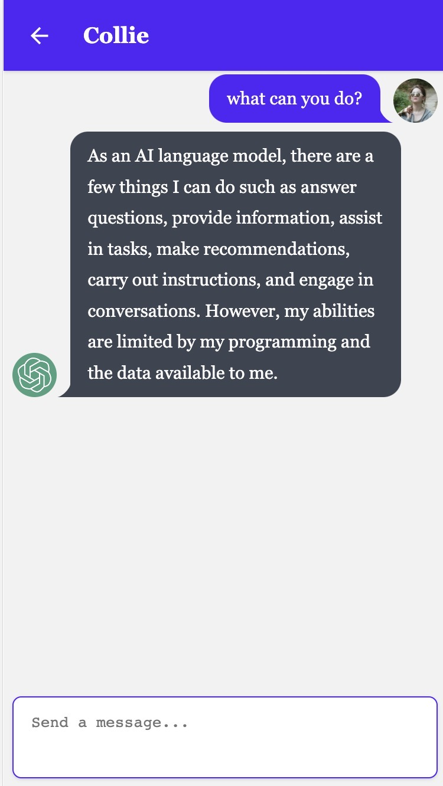

# 简介

[](https://pnpm.io/)
[](https://v3.vuejs.org/)
[](https://v3.nuxtjs.org/)
[](https://daisyui.com/)
[](https://pinia.vuejs.org/)
[](https://unocss.antfu.me/)
[](https://i18n.nuxtjs.org/)
[](https://www.typescriptlang.org/)

Collie是一个基于ChatGPT语言模型的在线聊天网站，旨在为用户提供智能有趣的对话体验

### PC端




### 移动端



## 使用

1.安装依赖

```bash
# pnpm
pnpm install
```
2.在根目录中创建一个 .env 文件并粘贴以下内容：
 ```
NUXT_PUBLIC_API_BASE=
NUXT_PUBLIC_SOCKET_URL=
 ```
  - **`NUXT_PUBLIC_API_BASE`** 服务器API地址
  - **`NUXT_PUBLIC_SOCKET_URL`** 服务器SOCKET地址

## Development Server

Start the development server on `http://localhost:3000`

```bash
npm run dev
```


Check out the [deployment documentation](https://nuxt.com/docs/getting-started/deployment) for more information.
